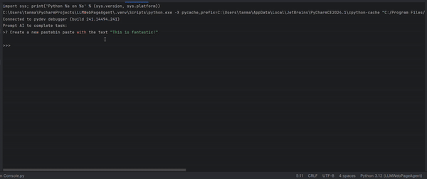

# LLMWebAgent
A simple open source LLM Web automator using a 4 agent pipeline.



## Getting Started:
1. Clone the repository to your folder: `git clone https://github.com/mannyjl16/LLMWebAgent`
2. Install Google Chrome
3. Install **LMStudio** and set up a local server with the `xtuner/llava-phi-3-mini-gguf` model for vision
4. Install the necessary python dependencies via `pip install requirements.txt`
5. Rename `.env.example` to `.env` and change the `GROQKEY` to your key
6. Run `python main.py`. *(Read below first)*

## How to use:
After completeing the setup. You will be prompted to enter a task. The task must utilize the controls available. Those are click, input, navigate to url, scroll down, enter and loop. The planner will break down the tasks into instructions which the command executor can interpret.

> Example: Goto google. Search for Burgers. Scroll down and click the first link related to Burgers.

You can watch your task be executed step by step by watching the browser. When the task is finished you can start another task. To loop the task make sure to tell it to loop at the end of your instruction.

>Do not be too abstract with your requests. Start small and work your way up. It wont be able to do something like buy amazon products and write reviews.

>If you have a more complex task possibly ditch the planner all together in the settings and use the chrome accessibility tree to debug the names of elements and step by step plan out your entire task. Make sure to put a new line after each instruction if you do this.


**How it works:** 
This implementation uses a simple 4 LLM agent pipeline. The agents being the planner, the command executor, the vision based webpage summarizer and the planner updater. The planner takes an intial prompt and creates a thought about how to go about completing the task. Then creates a list of instructions for the executor to carry out The executor sees a chrome accessibility tree of the current page. Including the ID, role and name of each element. The command executor then generates a thought and decides which function best suits the instruction given and to which node it applies if necessary.

The functions it can execute are `Navigate(url)`, `Click(ID)`, `Input(ID,text)`, `Enter()`, `Loop()`, `Sroll()`

> Example: Goto google. Search for Cars. Scroll down and click the first link related to cars

Which the planner may compile to navigate to `google.com`. Input Cars into the search bar. Click the first search result related to cars and then it may get executed as: 

```py
Navigate(google.com)
Input(72,Cars)
Enter()
Scroll()
Click(5678)
```
> This loop will run for each instruction step until it ends or something happens. In case of an exception, a screenshot is taken of the current webpage. Then an LLM with vision describes the webpage. The description of the webpage as well as the last plan, original prompt and all the previous commands executed is sent to the update planner. The planner determines where the execution went wrong and creates a new plan to execute.


## Optional
Modify the `Settings.py` to your liking. Edit the system prompt in the `LLMAgent.py`. Replace the vision model and agents with something like GPT4 or claude for better generalizations and task success. Modify the pipeline
